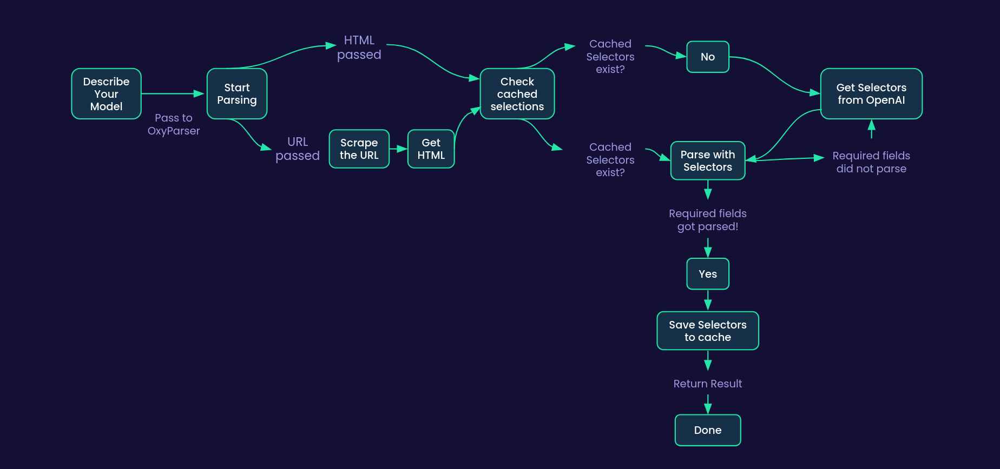

<h1 align="center">
        🤖 Oxy® Parser
    </h1>
    <p align="center">
        <p align="center">Parse HTMLs automatically by only describing the Pydantic model.
        <br>
    </p>
<h4 align="center">
    <a href="https://discord.gg/cZZ7Bw4xN3">
        
    </a>
</h4>

OxyParser does the heavy lifting of parsing HTMLs for you. It uses Pydantic models to describe the structure of the HTML and then automatically parses the HTMLs into the Pydantic models.:
- Describe a Pydantic model of your expected HTML structure
- Pass the URL or HTML to OxyParser together with the Pydantic model
- OxyParser will parse the HTML and return the parsed data as Pydantic models
- OxyParser will also cache the selectors for later re-use, so you don't need to call OpenAI's API every time you want to parse the same HTML

Supported cache backends:
- Memory
- File
- Redis

## See the flowchart for detailed view



## Installation

```bash
pip install oxyparser
```

## Supported LLMs

This project uses [LiteLLM](https://github.com/BerriAI/litellm) please refer to the documentation
to see the supported LLMs: https://docs.litellm.ai/docs/providers


## Usage

You will need to setup an `.env` file with the following variables:

`LLM_API_KEY`: Can be either OpenAI key, Claude key or any other LLM provider key. (See LiteLLM docs above for full info on supported LLMs)

`LLM_MODEL`: The model you want to use. (See LiteLLM docs above for full info on supported LLMs)

Scraper keys: they're optional, but if not provided, you will need to scrape and pass the HTMLs to OxyParser yourself.
However, we highly suggest to use Oxylabs scraper since it will remove the hassle of getting HTMLs and will also
provide you with a lot of other benefits like rotating IPs, handling captchas, bypassing blocks.

Click here to sign up for Oxylabs free trial: https://dashboard.oxylabs.io/en/registration?productToBuy=SCRAPI_WEB

`OXYLABS_SCRAPER_USER`: Your Oxylabs scraper user (optional)
`OXYLABS_SCRAPER_PASSWORD`: Your Oxylabs scraper password (optional)

```env
LLM_API_KEY=your_openai_api_key
LLM_MODEL=gpt-3.5-turbo
OXYLABS_SCRAPER_USER=your_oxylabs_scraper_user  # optional
OXYLABS_SCRAPER_PASSWORD=your_oxylabs_scraper_pass  # optional
```

Then you can use the following code to parse the website into structured data:

For full examples see the `examples` directory.

```python
from pydantic import BaseModel
from oxyparser.oxyparser import OxyParser

class JobItem(BaseModel):
    title: str
    recruiter_name: str
    location: str
    description: str


# this page might expire
# if it does, please replace it with a new one
# https://career.oxylabs.io
# also if you're a python dev and looking for job, hit us up!
URL: str = "https://career.oxylabs.io/job/813b9ac5/python-developer-mid-senior/"


async def main() -> None:
    parser = OxyParser()
    job_item = await parser.parse(URL, JobItem)
    print(job_item)


if __name__ == "__main__":
    import asyncio

    asyncio.run(main())
```


If you have a HTML string instead of a URL, you can pass it to the parser as well like so:

```python
parser = OxyParser()

html = "<html><body>" "<h1>John</h1>" "<h2>Smith</h2>" "<p>Svitrigailos st.</p>" "<span>2 years old</span></body></html>"
url = "https://example.com"  # url is needed to cache selectors
parsed_item = await parser.parse(url=url, model=JobItem, html=html)
print(job_item)
```

## Known Issues

There are know nuances where sometimes the extracted xpath fails to extract some data. 
For example where description is very long or nested by many elements. In such cases for now we recommend manually
editing the selectors in cache. These shouldn't be an often case though.
Create an issue if you encounter any other issues.

## Contributing

We welcome all contributions. To contribute - clone the repo, create a new branch, make your changes and create a pull request.
