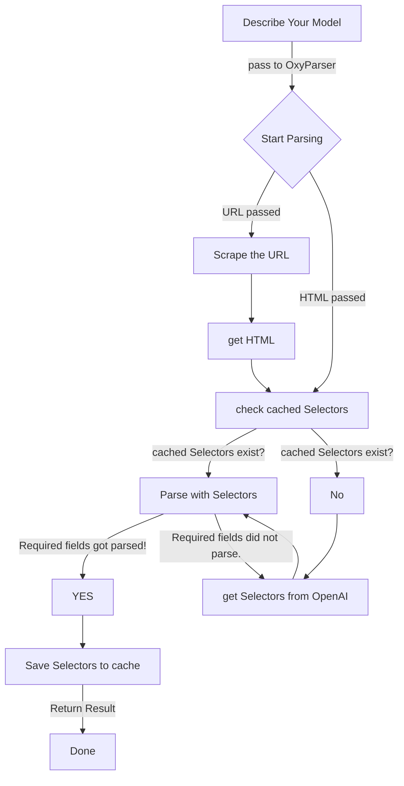

<h1 align="center">
        🤖 OxyParser
    </h1>
    <p align="center">
        <p align="center">Parse HTMLs automatically by only describing the Pydantic model.
        <br>
    </p>
<h4 align="center">
    <a href="https://discord.gg/cZZ7Bw4xN3">
        
    </a>
</h4>

OxyParser does the heavy lifting of parsing HTMLs for you. It uses Pydantic models to describe the structure of the HTML and then automatically parses the HTMLs into the Pydantic models.:
- Describe a Pydantic model of your expected HTML structure
- Pass the URL or HTML to OxyParser together with the Pydantic model
- OxyParser will parse the HTML and return the parsed data as Pydantic models
- OxyParser will also cache the selectors for later re-use, so you don't need to call OpenAI's API every time you want to parse the same HTML




## Installation

```bash
pip install oxyparser
```

## Supported LLMs

This project uses [LiteLLM](https://github.com/BerriAI/litellm) please refer to the documentation
to see the supported LLMs: https://docs.litellm.ai/docs/providers


## Usage

You will need to setup an `.env` file with the following variables:
```env
LLM_API_KEY=your_openai_api_key
OXYLABS_SCRAPER_USER=your_oxylabs_scraper_user  # optional
OXYLABS_SCRAPER_PASSWORD=your_oxylabs_scraper_pass  # optional
```

Oxylabs credentials are optional, you can also pass your own HTML.
However, we highly suggest to use Oxylabs scraper since it will remove the hassle of getting HTMLs and will also
provide you with a lot of other benefits like rotating IPs, handling captchas, bypassing blocks.

Then you can use the following code to parse the HTML:

For full examples see the `examples` directory.

```python
from pydantic import BaseModel
from oxyparser.oxyparser import OxyParser

class JobItem(BaseModel):
    title: str
    recruiter_name: str
    location: str
    description: str


# this page might expire
# if it does, please replace it with a new one
# https://career.oxylabs.io
# also if you're a python dev and looking for job, hit us up!
URL: str = "https://career.oxylabs.io/job/813b9ac5/python-developer-mid-senior/"


async def main() -> None:
    parser = OxyParser()
    job_item = await parser.parse(URL, JobItem)
    print(job_item)


if __name__ == "__main__":
    import asyncio

    asyncio.run(main())
```


If you have a HTML string instead of a URL, you can pass it to the parser as well like so:

```python
parser = OxyParser()

html = "<html><body>" "<h1>John</h1>" "<h2>Smith</h2>" "<p>Svitrigailos st.</p>" "<span>2 years old</span></body></html>"
url = "https://example.com"  # url is needed to cache selectors
parsed_item = await parser.parse(url=url, model=JobItem, html=html)
print(job_item)
```


You can rely fully on OxyParser to parse the HTMLs for you. 
It will cache the selectors for later re-use. So, you only need to get the selectors from OpenAI once.
You can modify the cache manually if OpenAI fails to parse specific selectors.

Supported cache backends:
- Memory
- File
- Redis
